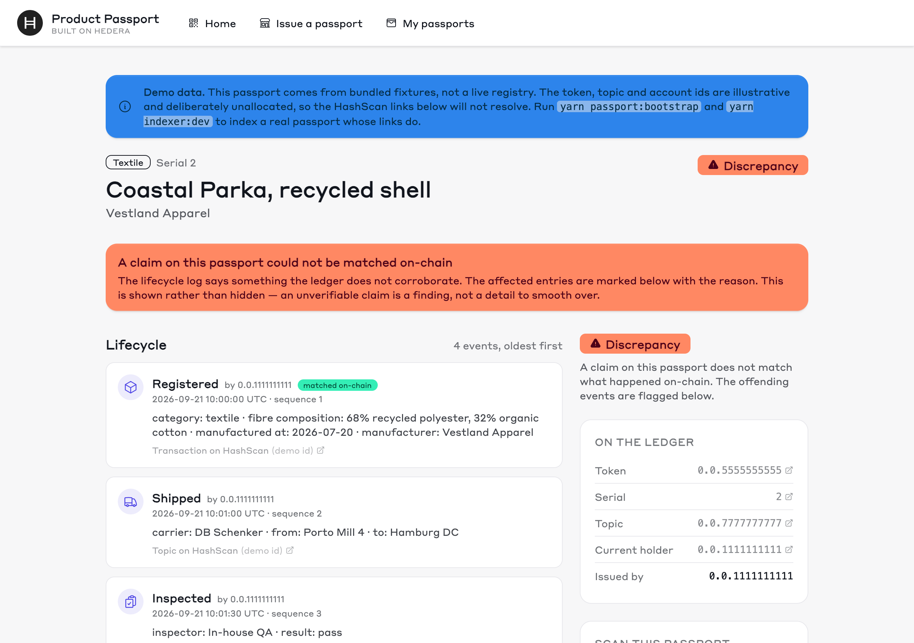
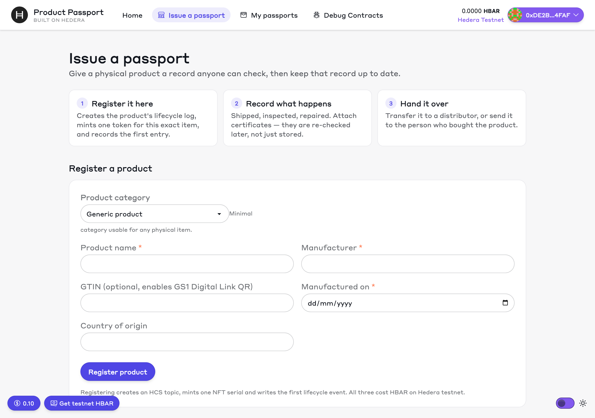
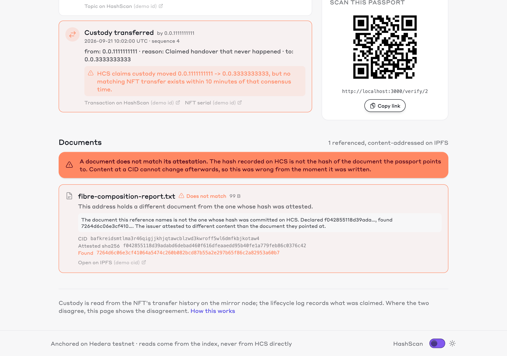

# product-passport

**Give a physical product a public, verifiable history.** A battery, a garment, a
pallet of coffee. Scan a QR code, see everything that happened to it, and check
every claim against Hedera yourself.

```bash
npm create scaffold-hbar@latest my-passports -- --template Musaga-Technology/scaffold-hbar-dpp
```

A scaffold-hbar template. Next.js + Hardhat + a mirror-node indexer + IPFS or
Arweave for the documents.

**What makes this more than a database with a blockchain attached:**

- **Certificates are content-addressed, and checked without trusting anyone.**
  A conformity declaration or test report lives on IPFS, and the passport
  commits its CID plus a sha256 to HCS. The indexer fetches it back from public
  gateways it does not trust, checks every block against the CID, and compares
  the rebuilt document with the committed hash. A gateway that serves altered
  content is caught and skipped. An issuer who points at one document and
  attests to another is flagged in red — not a broken link, not a green tick.
- **Custody is reconciled, not asserted.** The event log says what someone
  *claimed* happened. The token's transfer history says what the network
  actually recorded. Where they disagree the passport shows a **discrepancy**
  instead of quietly picking one.
- **Nothing here asks for trust.** Every claim links to HashScan, and
  `yarn indexer:verify` rebuilds the whole index from the ledger to prove it
  matches.

Remove IPFS and a passport's documents become URLs: you would have to trust
whoever hosts them, and the party most motivated to swap a certificate is often
the one hosting it. With a CID checked block by block, nobody has to be trusted
— which, for a regulated product, is most of the record. That is why storage is
part of the template rather than an add-on.

## Two ways in

| | What you need | What you get |
| --- | --- | --- |
| **Look at it** — 30 seconds | nothing | Bundled data, including a passport that **fails** its checks — the case a fresh registry cannot show you |
| **Run it for real** — 5 commands | a funded [testnet account](https://portal.hedera.com) | Your own registry on Hedera: tokens, topics, documents on IPFS, all verifiable on HashScan |

It is already running on testnet if you would rather see that first:
[serial 2 and its lifecycle topic](#proof-it-runs-on-hedera-testnet).

## What people use this for

A Digital Product Passport is a regulatory requirement arriving product
category by product category — batteries first, in the EU, from February 2027,
then textiles, electronics and more under the ESPR. The shape is always the
same: an item, a history, documents to back it up, and someone downstream who
has to check them.

| | What the passport carries | Who checks it |
| --- | --- | --- |
| **EV and industrial batteries** | chemistry, capacity, carbon footprint, state of health, recycled content | recyclers, regulators, second-life buyers |
| **Textiles and footwear** | fibre composition, mill, dye process, repair history | customs, resale platforms, brands policing their own supply chain |
| **Food and coffee** | origin lot, cold-chain events, organic and fair-trade certificates | importers, retailers, auditors |
| **Pharmaceuticals** | batch, cold-chain excursions, chain of custody | pharmacies, inspectors |
| **Machinery and spare parts** | serial, service log, conformity declarations | field engineers, insurers, buyers of used equipment |
| **Luxury goods** | provenance, ownership handovers, authentication reports | resale market, customs |

Battery, textile and a generic category ship with the template. **Adding one is
a single JSON file** in `schemas/categories/` — no code — and it drives the
registration form, the validation and how the passport renders. See
[Extend it](#extend-it).

---

## Look at it — 30 seconds, no account

```bash
yarn install
yarn next:start
```

Open **http://localhost:3000/verify/1**.

That is a battery passport, running on bundled demo data. Now open
**/verify/2** — a garment whose issuer linked the lab's real fibre report (41%
recycled) but committed the hash of a better-looking version (68%). The page
says so, in red, instead of showing a green tick.

That contrast is the entire point of the template. Everything below is how to do
it with real products.



The demo's token and topic ids are deliberately unallocated, so its HashScan
links do not resolve and the page says so. The
[testnet passport below](#proof-it-runs-on-hedera-testnet) is the real thing,
links and all. [See the whole demo passport](docs/screenshots/verify-discrepancy-full.png).

## Run it for real — 5 commands

You need **Node ≥ 20.18.3** and a funded **ECDSA** Hedera account. The portal
offers ECDSA and ED25519; only ECDSA works here.

```bash
yarn install
yarn hardhat:account:generate     # or account:import if you already have a key
# fund the printed address at https://portal.hedera.com/faucet  (~25 HBAR)
yarn passport:bootstrap           # deploys, then registers one demo product
yarn indexer:dev                  # reads the mirror node, checks every claim
yarn next:start                   # http://localhost:3000/verify/1
```

Set `PINATA_JWT` in `packages/hardhat/.env` first (a free key from
[pinata.cloud](https://pinata.cloud) is enough) and the bootstrap also pins the
token metadata and a conformity declaration to IPFS, then attaches the
declaration to the inspection event for the indexer to verify. Without it,
everything else still runs.

`passport:bootstrap` is idempotent — if it fails halfway, fix the cause and run
it again. Finished steps are skipped, not paid for twice. If anything looks
wrong, `yarn passport:status` checks every entity against the mirror node.

> **It registers a product for you.** When the bootstrap finishes you already own
> a live passport: serial 1, with a topic carrying its first three lifecycle
> events. `/verify/1` is now that product, not the demo.

## Proof it runs on Hedera testnet

Serial 2 was bootstrapped on 22 September 2026 and exercises every part of the
template, including a real document. Open any of these:

| | |
| --- | --- |
| Registry contract | [`0xCBc3089c…5f22D5a7A`](https://hashscan.io/testnet/contract/0xCBc3089cb39ef55114341Ff1aB9BFeA5f22D5a7A) |
| Collection | [`0.0.10649382`](https://hashscan.io/testnet/token/0.0.10649382) |
| Passport serial 2 | [`0.0.10649382/2`](https://hashscan.io/testnet/token/0.0.10649382/2) |
| Lifecycle topic | [`0.0.10668028`](https://hashscan.io/testnet/topic/0.0.10668028) |
| HIP-412 metadata, on the serial | [`ipfs://bafkreidu7j…vkylwi`](https://inbrowser.link/ipfs/bafkreidu7jb6w3eaddepjfptlng2skhjulk7abdpqftgwncw6eq5vkylwi) |
| Declaration of conformity, attached to the inspection | [`ipfs://bafkreihtnn…nsa2e`](https://inbrowser.link/ipfs/bafkreihtnneuanum2wo7tikuj7wgmrw4owgnbruv7h5mh4diduxx5nsa2e) |

Read the topic yourself, without trusting this page:

```bash
curl -s "https://testnet.mirrornode.hedera.com/api/v1/topics/0.0.10668028/messages?order=asc" \
  | jq -r '.messages[] | "\(.sequence_number) \(.message|@base64d)"'
```

The third message is the inspection. Its attachment commits the declaration's
CID and its sha256, `f36b4940…6eb640d1`. The document is small enough to be a
single raw block, so that sha256 is literally inside the CID — decode
`bafkreihtnn…` and you get the same 32 bytes. The indexer fetches the
declaration back as a CAR from a public gateway it does not trust, checks it
against the CID, and reports it verified. The links above open through
`inbrowser.link`, which does the same check in your browser.

## Register your own products

The bootstrap is setup. **The issuer page is the actual tool.**

Open **http://localhost:3000/issuer** and connect a wallet.



| Step | Where | What happens |
| --- | --- | --- |
| 1. Register a product | `/issuer` | Creates an HCS topic, mints one NFT serial against it, writes the first event |
| 2. Log what happens to it | `/issuer/[serial]` | Shipped, inspected, repaired — each one a hash-anchored message on its topic |
| 3. Attach documents | `/issuer/[serial]` | Certificates and reports, stored by content address and re-checked later |
| 4. Hand it over | `/issuer/[serial]` | Transfer custody to another wallet, or airdrop it to the buyer |
| 5. Anyone verifies | `/verify/[serial]` | No wallet, no account, no permission needed |

Pick the product type from the category dropdown. **A category is just a JSON
file** in `schemas/categories/` — battery, textile and generic ship as examples.
Adding food, pharmaceuticals or machine parts means adding a file, not writing
code.

## How it works, briefly

```
your product  ──┬──  HTS NFT serial      "which item is this, and who holds it"
                │
                ├──  HCS topic           "what happened to it, in what order"
                │
                └──  IPFS / Arweave      "the certificates, by content address"
                          │
                     indexer ──── reads the first two from the mirror node and
                                  the third from untrusted gateways, checks
                                  they agree, and serves the answer
```

The interesting part is the last line. HCS carries *claims* — someone said this
product shipped. The NFT's transfer history is what actually happened. The
indexer compares them, and where they disagree the passport says **discrepancy**
rather than quietly picking one.

It does the same for documents. Each one is fetched back as a CAR from
[trustless gateways](https://specs.ipfs.tech/http-gateways/trustless-gateway/),
every block is hashed and checked against the CID, and only then is the
rebuilt document compared with the sha256 committed on HCS. So a verdict never
rests on a gateway's word:

- **verified** — the document the CID names is the one that was attested
- **does not match** — the CID names a different document from the one whose
  hash was committed. Content at a CID cannot change, so this was wrong from
  the moment it was written. It downgrades the passport.
- **unreachable** — no gateway served a copy that checked out. Proves nothing
  either way, and does not downgrade anything.

That is what `/verify/2` shows — the attested hash and the one actually found,
side by side.



Reads never touch HCS directly — they come from the index, which is rebuildable
from the mirror node at any time. `yarn indexer:verify` proves it by replaying
from scratch and diffing.

Why it is built this way: [docs/design-notes.md](docs/design-notes.md).

## What you need installed

| Path | Requirement |
| --- | --- |
| Explore offline | Node ≥ 20.18.3. Corepack ships with Node and provides Yarn 3.2.3. |
| Run on testnet | The same, plus a funded ECDSA account. |
| Run everything in containers | Docker. No Node, no Yarn, no Solidity toolchain. |

`yarn install` pulls about 2.6 GB — Next.js, RainbowKit and the Solidity
toolchain, mostly inherited from scaffold-hbar. If you only want to *run* the
template, `docker compose up` needs Docker alone.

## Commands

| Command | What it does |
| --- | --- |
| `yarn passport:bootstrap` | Zero to a live passport on Hedera testnet |
| `yarn passport:new-product` | Register another demo product on the same registry; earlier ones stay indexed |
| `yarn passport:status` | Check every entity against the mirror node |
| `yarn indexer:dev` | Poll, reconcile, serve the index API |
| `yarn indexer:replay` | Drop the index and rebuild from sequence 1 |
| `yarn indexer:verify` | Replay into a temp index and diff it against the live one |
| `yarn next:start` | Run the app |
| `yarn lint` · `yarn next:build` · `yarn hardhat:test` · `yarn indexer:test` | The gates CI runs |
| `yarn hardhat:test:forking` | Optional — runs the contract against the real HTS precompile on a fork |

## Deploy it

```bash
docker compose up
```

App, indexer and Postgres on any container host — laptop, VM, on-prem, any
cloud. Nothing here is tied to a vendor. Fly, Railway, Render and ECS all take
the same containers; [`fly.toml`](fly.toml) is a worked example for the indexer,
health check and volume included.

[](https://vercel.com/new)

One-click preview of the **public page only**. Serverless platforms cannot run
the indexer — it needs a persistent process and a database — so a passport
deployed this way shows demo data until `INDEX_API_URL` points at an indexer
hosted somewhere that can run one.

## Configure it

Everything runs with no configuration at all. These are for connecting it to
something real — full table in [docs/configuration.md](docs/configuration.md).

| Variable | Where | For |
| --- | --- | --- |
| `HEDERA_OPERATOR_ID` / `HEDERA_OPERATOR_PRIVATE_KEY` | app, **server-side only** | Creating topics, submitting events |
| `PINATA_JWT` *or* `ARWEAVE_JWK` | app, server-side only | Storing documents |
| `INDEX_API_URL` | app | Where to read the index; unset means demo fixtures |
| `INDEXER_TOPIC_IDS` / `PASSPORT_REGISTRY_ADDRESS` | indexer | What to index |
| `DATABASE_URL` | indexer | Use Postgres instead of SQLite |

The operator variables deliberately have **no** `NEXT_PUBLIC_` prefix — that
would inline the key that signs every HCS submission into the browser bundle.
Leave them unset and the two write routes return 503 with instructions.

## Extend it

| To do this | Change this | Code changes |
| --- | --- | --- |
| Add a product category | one file in `schemas/categories/` | none |
| Add an event type | the schema pattern + one decoder | one function |
| Change how reconciliation decides | `packages/indexer/src/reconcile.ts` | that file only |
| Swap the storage provider | `packages/nextjs/services/storage/` | one `put` method |
| Swap SQLite for Postgres | set `DATABASE_URL` | none |

`AGENTS.md` is the briefing for coding agents working in this repo.

## Troubleshooting

| Symptom | Cause |
| --- | --- |
| "No deployer account is configured" | Run `account:generate`, or `account:import` if you already have a key |
| `HtsCreateFailed(9)` | Token creation fee too low — raise `BOOTSTRAP_COLLECTION_FEE_HBAR` |
| Passport stuck on `pending` | The indexer has not caught up. Is `yarn indexer:dev` running? |
| Issuer page says "No registry configured" | Run `yarn passport:bootstrap` first |
| Anything else | `yarn passport:status` — it checks every entity and needs no key |

`npx hedera-harness validate` reports `packages/hardhat/.env` as a forbidden file
once you have run `account:generate` or `account:import`. That is expected and
local-only: the file is gitignored, never committed, and holds an *encrypted*
keystore rather than a raw key. A fresh clone has no `.env` and validates clean.

## Links

- [Design notes](docs/design-notes.md) — why it is built this way
- [Fresh-machine check](docs/fresh-machine-check.md) — what a clean scaffold actually produces, with real timings
- [Configuration](docs/configuration.md) — every environment variable
- [AGENTS.md](AGENTS.md) — briefing for coding agents
- [Hedera docs](https://docs.hedera.com) · [HashScan testnet](https://hashscan.io/testnet) · [Portal faucet](https://portal.hedera.com/faucet)

## Disclaimer

Example code for building on Hedera. Audit before production use. Passports are
public by design — anything written to a topic is readable by anyone, forever.

## License

MIT. Copyright (c) 2026 Musaga Technology, with the upstream BuidlGuidl and
hedera-dev notices retained in [LICENSE](LICENSE).
