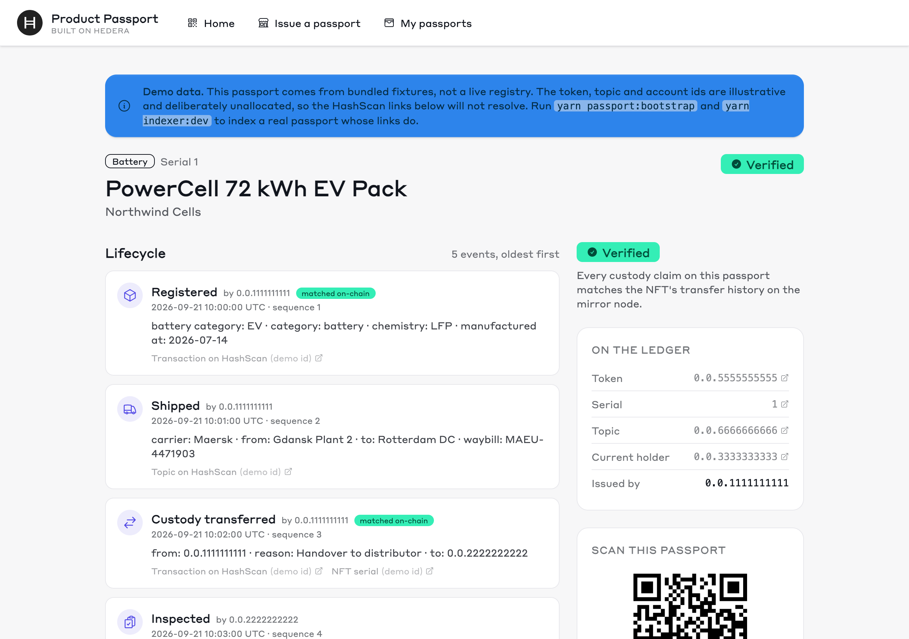
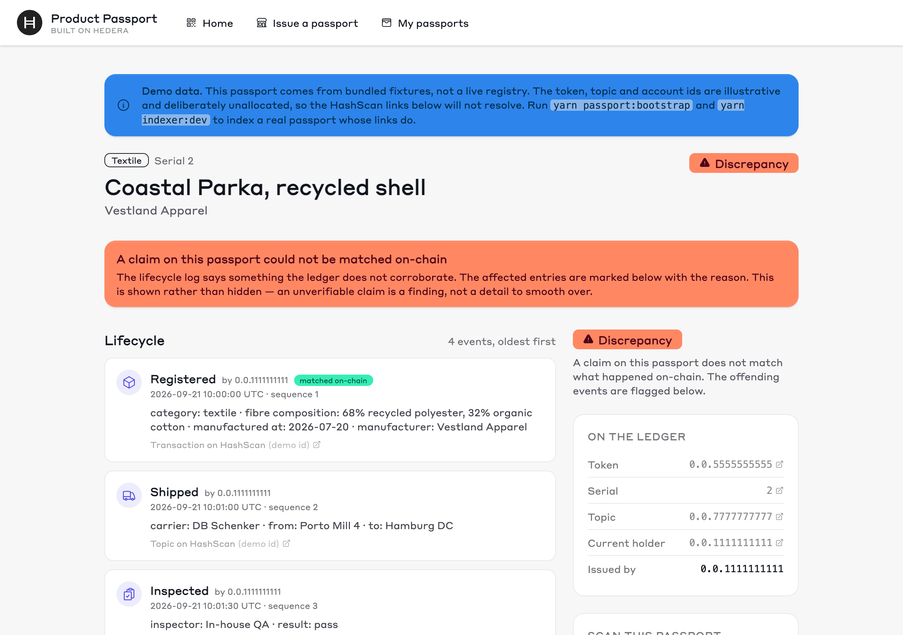
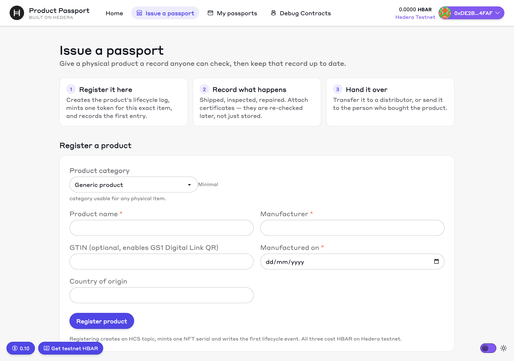
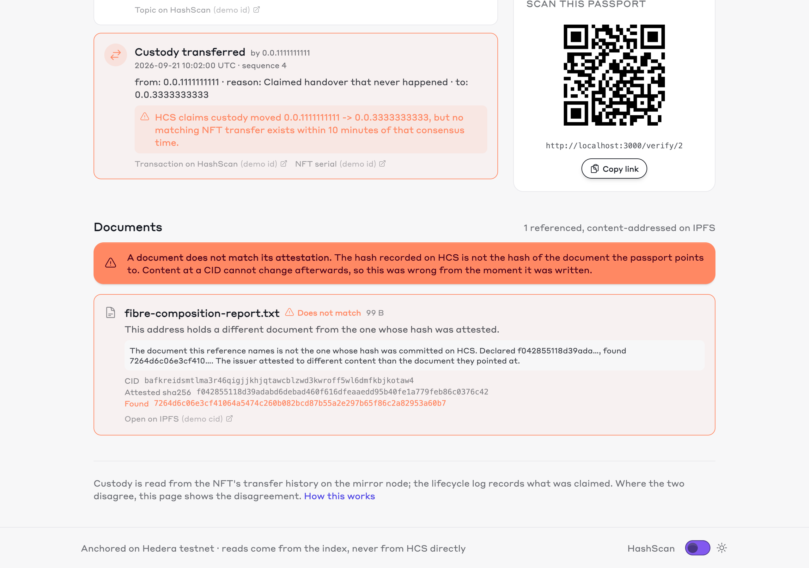

# product-passport

[](https://github.com/Musaga-Technology/scaffold-hbar-dpp/actions/workflows/ci.yml)
[](https://github.com/Musaga-Technology/scaffold-hbar-dpp/actions/workflows/fresh-scaffold.yml)

[](#proof-it-runs-on-hedera-testnet)
[](LICENSE)


**Give a physical product a public, verifiable history.** A battery, a garment, a
pallet of coffee. Scan a QR code, see everything that happened to it, and check
every claim against Hedera yourself.

```bash
npm create scaffold-hbar@latest my-passports -- --template Musaga-Technology/scaffold-hbar-dpp
```

A scaffold-hbar template. Next.js + Hardhat + a mirror-node indexer + IPFS or
Arweave for the documents.

<p align="center">
  <a href="https://youtu.be/kcVanYI-7HM"></a><br />
  <sub>▶ <a href="https://youtu.be/kcVanYI-7HM">Watch the 4½-minute demo</a>: one command to scaffold, a passport with no keys, a fresh registry on testnet, products registered and handed over through MetaMask, and every claim checked on HashScan.</sub>
</p>

| A passport whose claims check out | A passport that is caught |
| --- | --- |
|  |  |

**Contents:** [Two ways in](#two-ways-in) · [What people use it for](#what-people-use-this-for) ·
[Prerequisites](#what-you-need-installed) · [Look at it](#look-at-it--30-seconds-once-installed-no-account) ·
[Run it for real](#run-it-for-real--5-commands) · [Proof on testnet](#proof-it-runs-on-hedera-testnet) ·
[Register your own products](#register-your-own-products) · [How it works](#how-it-works-briefly) ·
[Commands](#commands) · [Deploy](#deploy-it) · [Configure](#configure-it) · [Extend](#extend-it) ·
[Start over](#starting-over-with-a-fresh-registry) · [Troubleshooting](#troubleshooting)

**What makes this more than a database with a blockchain attached:**

- **Certificates are content-addressed, and checked without trusting anyone.**
  A conformity declaration or test report lives on IPFS, and the passport
  commits its CID plus a sha256 to HCS. The indexer fetches it back from public
  gateways it does not trust, checks every block against the CID, and compares
  the rebuilt document with the committed hash. A gateway that serves altered
  content is caught and skipped. An issuer who points at one document and
  attests to another is flagged in red — not a broken link, not a green tick.
- **Custody is reconciled, not asserted.** The event log says what someone
  *claimed* happened. The token's transfer history says what the network
  actually recorded. Where they disagree the passport shows a **discrepancy**
  instead of quietly picking one.
- **Nothing here asks for trust.** Every claim links to HashScan, and
  `yarn indexer:verify` rebuilds the whole index from the ledger to prove it
  matches.

Remove IPFS and a passport's documents become URLs: you would have to trust
whoever hosts them, and the party most motivated to swap a certificate is often
the one hosting it. With a CID checked block by block, nobody has to be trusted
— which, for a regulated product, is most of the record. That is why storage is
part of the template rather than an add-on.

## Two ways in

| | What you need | What you get |
| --- | --- | --- |
| **Look at it** — 30 seconds once installed | nothing | Bundled data, including a passport that **fails** its checks — the case a fresh registry cannot show you |
| **Run it for real** — 5 commands | a funded [testnet account](https://portal.hedera.com) | Your own registry on Hedera: tokens, topics, documents on IPFS, all verifiable on HashScan |

It is already running on testnet if you would rather see that first:
[serial 3 and its lifecycle topic](#proof-it-runs-on-hedera-testnet). If you
would rather read than run: [design notes](docs/design-notes.md) covers why
reconciliation, content addressing and the index work the way they do, and
[AGENTS.md](AGENTS.md) is the briefing for coding agents working in the repo.

## What people use this for

A Digital Product Passport is a regulatory requirement arriving product
category by product category — batteries first, in the EU, from February 2027,
then textiles, electronics and more under the ESPR. The shape is always the
same: an item, a history, documents to back it up, and someone downstream who
has to check them.

| | What the passport carries | Who checks it |
| --- | --- | --- |
| **EV and industrial batteries** | chemistry, capacity, carbon footprint, state of health, recycled content | recyclers, regulators, second-life buyers |
| **Textiles and footwear** | fibre composition, mill, dye process, repair history | customs, resale platforms, brands policing their own supply chain |
| **Food and coffee** | origin lot, cold-chain events, organic and fair-trade certificates | importers, retailers, auditors |
| **Pharmaceuticals** | batch, cold-chain excursions, chain of custody | pharmacies, inspectors |
| **Machinery and spare parts** | serial, service log, conformity declarations | field engineers, insurers, buyers of used equipment |
| **Luxury goods** | provenance, ownership handovers, authentication reports | resale market, customs |

Building something sustainability-focused? The battery category already carries
`carbonFootprintKgPerKwh` and `recycledContentPct`, and `product.repaired` and
`product.recycled` are shipped event types. Read
[what this proves and what it does not](docs/design-notes.md#sustainability-claims-and-where-this-template-stops)
first — it verifies that a document is the one that was attested, not that a
number is true — and how it fits with [Guardian](https://github.com/hashgraph/guardian),
which exists for the second problem.

Battery, textile and a generic category ship with the template. **Adding one is
a single JSON file** in `schemas/categories/` — no code — and it drives the
registration form, the validation and how the passport renders. See
[Extend it](#extend-it).

---

## What you need installed

| Path | Requirement |
| --- | --- |
| Explore offline | Node ≥ 20.18.3. Corepack ships with Node and provides Yarn 3.2.3. |
| Run on testnet | The same, plus a funded ECDSA account. |
| Run it in containers | Docker alone — for the demo, or a registry you have already bootstrapped. The bootstrap itself runs on the host. |

## Look at it — 30 seconds once installed, no account

```bash
yarn install
yarn next:start
```

Open **http://localhost:3000/verify/1**.

That is a battery passport, running on bundled demo data. Now open
**/verify/2** — a garment whose issuer linked the lab's real fibre report (41%
recycled) but committed the hash of a better-looking version (68%). The page
says so, in red, instead of showing a green tick.

That contrast is the entire point of the template. Everything below is how to do
it with real products.

**/verify/3** is different: a snapshot of a real passport on Hedera testnet,
bundled so you can see one before deploying anything. Its links open the
actual records on HashScan and IPFS.


The demo's token and topic ids are deliberately unallocated, so its HashScan
links do not resolve and the page says so. The
[testnet passport below](#proof-it-runs-on-hedera-testnet) is the real thing,
links and all. [See the whole demo passport](docs/screenshots/verify-discrepancy-full.png).

## Run it for real — 5 commands

You need **Node ≥ 20.18.3** and a funded **ECDSA** Hedera account. The portal
offers ECDSA and ED25519; only ECDSA works here.

**Your passport gets a verified document either way.** The bootstrap attaches a
conformity declaration to the demo inspection, and the indexer fetches it back
from public IPFS gateways and checks it against its CID. With no storage key,
it attaches a shared copy that is already on IPFS — the document is identical
in every bootstrap, so its content address is too, and there is nothing to
upload. For your own copy, and for token metadata on IPFS rather than served by
the app, put `PINATA_JWT` in `packages/hardhat/.env` before you bootstrap (a
free key from [pinata.cloud](https://pinata.cloud) is enough; the file exists
once you have run `account:generate` or `account:import`).

```bash
yarn install
yarn hardhat:account:generate     # or account:import if you already have a key
# fund the printed address at https://portal.hedera.com/faucet  (~25 HBAR)
yarn passport:bootstrap           # deploys, then registers one demo product
yarn indexer:dev                  # reads the mirror node, checks every claim
yarn next:start                   # http://localhost:3000/verify/1
```

> **It registers a product for you.** When the bootstrap finishes you already own
> a live passport: serial 1, with a topic carrying its first three lifecycle
> events. `/verify/1` is now that product, not the demo.

`passport:bootstrap` is idempotent — if it fails halfway, fix the cause and run
it again. Finished steps are skipped, not paid for twice. If anything looks
wrong, `yarn passport:status` checks every entity against the mirror node, and
`yarn passport:verify` publishes the registry's source on HashScan.

## Proof it runs on Hedera testnet

Serial 3 was made on 29–30 September 2026 entirely through the issuer page,
with MetaMask — not by a script. It exercises the whole lifecycle: registered,
shipped, inspected with a lab report attached, and handed over. Every step,
as it happened:

| Step | On Hedera |
| --- | --- |
| Registry deployed — source verified | [`0xCBc3089c…5f22D5a7A`](https://hashscan.io/testnet/contract/0xCBc3089cb39ef55114341Ff1aB9BFeA5f22D5a7A) |
| HTS collection created by the registry | [`0.0.10649382`](https://hashscan.io/testnet/token/0.0.10649382) |
| Lifecycle topic created for serial 3 | [`0.0.10777326`](https://hashscan.io/testnet/topic/0.0.10777326) |
| Serial 3 minted, signed in MetaMask | [mint transaction](https://hashscan.io/testnet/transaction/1790689293.129069105) |
| Event 1 — registered | [HCS message](https://hashscan.io/testnet/transaction/1790689326.912431571) |
| Event 2 — shipped | [HCS message](https://hashscan.io/testnet/transaction/1790738289.761227104) |
| Event 3 — inspected, lab report attached by CID | [HCS message](https://hashscan.io/testnet/transaction/1790738634.226304104) · [report on IPFS](https://inbrowser.link/ipfs/bafkreidsm7uqlroeataasyanykegbplrvk2vytfgaba7s5spbgbqs5td4m) |
| NFT handed over to `0.0.7190733`, signed in MetaMask | [transfer transaction](https://hashscan.io/testnet/transaction/1790739384.189979684) |
| Event 4 — custody transferred, the claim that must match it | [HCS message](https://hashscan.io/testnet/transaction/1790739452.647693104) |
| The passport itself | [serial 3](https://hashscan.io/testnet/token/0.0.10649382/3) · [HIP-412 metadata](https://inbrowser.link/ipfs/bafkreigi6mq5i3zi3cqna7v5eau5v4qwxuchqm5w5qfnrplsdfz3nfxiyu) |

Read the topic yourself, without trusting this page:

```bash
curl -s "https://testnet.mirrornode.hedera.com/api/v1/topics/0.0.10777326/messages?order=asc" \
  | jq -r '.messages[] | "\(.sequence_number) \(.message|@base64d)"'
```

Four messages, each carrying the sha256 of its own payload:

1. **Registered.** The indexer matches it to the mint on the collection.
2. **Shipped**, Porto mill to Hamburg DC.
3. **Inspected**, with the report attached by its CID and its sha256,
   `7267e905…097663e3`. The report is small enough to be a single raw block,
   so that sha256 is literally inside the CID — decode `bafkreidsm7…` and you
   get the same 32 bytes. The indexer fetches the report back as a CAR from a
   public gateway it does not trust, checks it against the CID, and reports it
   verified.
4. **Custody transferred** from the registry (`0.0.10649381`) to the issuer
   (`0.0.7190733`). The NFT moved first; the claim followed; the indexer
   matched the two and reports the hand-over **reconciled**.

The links above open through `inbrowser.link`, which checks the content
against its CID in your browser.

## Register your own products

The bootstrap is setup. **The issuer page is the actual tool.** It needs three
things the bootstrap deliberately does not do for you, and the page tells you
which one is missing before you fill anything in:

1. **An operator key in the app.** Registering creates the product's HCS topic
   from the server, which needs an operator account and its key. The bootstrap
   has already written the account — `HEDERA_OPERATOR_ID`, the `0.0.x` id it
   printed as `operator` — into `packages/nextjs/.env.local`. It never writes
   the key; that one line is yours. The key is your deployer key, which
   `yarn hardhat:account:reveal-pk` prints after asking for the password:

   ```bash
   HEDERA_OPERATOR_PRIVATE_KEY=0x…      # ECDSA, hex — server-side, never NEXT_PUBLIC_
   ```

   Add it to `packages/nextjs/.env.local`; the dev server picks it up on save.

2. **A wallet the registry accepts.** Only the registry's owner — the account
   you bootstrapped with — and wallets it allow-lists can register. Import that
   account into MetaMask (the same `reveal-pk` output), or call `setIssuer` for
   another address from the Debug Contracts page. If MetaMask is on another
   network, the app offers to switch it to Hedera testnet.
3. **Optional: `PINATA_JWT` in `packages/nextjs/.env.local` too**, to attach
   documents from this page. The bootstrap's copy in `packages/hardhat/.env`
   only covers the bootstrap.

Then open **http://localhost:3000/issuer** and connect.

> **The first visit is slow in dev mode.** `yarn next:start` compiles pages on
> demand, and the wallet pages pull in RainbowKit and its connectors — about
> 20,000 modules, one to two minutes on a laptop, once. The public pages compile
> in seconds. `yarn next:build && yarn next:serve` gives a production server
> with no waiting.



| Step | Where | What happens |
| --- | --- | --- |
| 1. Register a product | `/issuer` | Creates an HCS topic, mints one NFT serial against it, writes the first event |
| 2. Log what happens to it | `/issuer/[serial]` | Shipped, inspected, repaired — each one a hash-anchored message on its topic |
| 3. Attach documents | `/issuer/[serial]` | Certificates and reports, stored by content address and re-checked later |
| 4. Hand it over | `/issuer/[serial]` | Transfer custody to another wallet, or airdrop it to the buyer |
| 5. Anyone verifies | `/verify/[serial]` | No wallet, no account, no permission needed |

Pick the product type from the category dropdown. **A category is just a JSON
file** in `schemas/categories/` — battery, textile and generic ship as examples.
Adding food, pharmaceuticals or machine parts means adding a file, not writing
code.

If a registration fails partway — you reject the wallet prompt, or the
transaction reverts — just submit again. The product's topic is created before
the mint, and a retry reuses it rather than leaving an unused one behind.

### Logging what happens

On `/issuer/[serial]`, **Log a lifecycle event** appends one entry to the
product's history. The event types come from its category file; each asks for a
few details:

| Event | Details |
| --- | --- |
| `product.shipped` | from, to, carrier, waybill |
| `product.inspected` | result (pass, fail, conditional), inspector, note |
| `product.repaired` | component, note |
| `product.recycled` | facility, note |

Any event can carry a document. It is pinned to IPFS and the event records its
CID and sha256 — never the file itself — and the indexer then fetches it back
and checks it against the CID, so the passport shows it as verified.

Worth knowing before your first one:

- **Events are permanent.** HCS is append-only: a mistake cannot be edited or
  deleted. Log a correcting event instead — the correction is part of the record.
- **The server submits it**, using the operator key, after checking the
  schema, the 1024-byte limit, and that your wallet may log events for this
  serial (the registry's `setEventLogger` allow-list; the owner and the
  product's issuer always may).
- **It appears on the passport within seconds**, once the indexer has read it.
  The page reads the index, never HCS directly, so keep `yarn indexer:dev`
  running.

### Handing it over

**Transfer custody** moves the NFT first and records the hand-over second, so
the history never claims a transfer the ledger did not make. The indexer then
checks the claim against the actual NFT transfer.

- **A new passport is held by the registry** until its first hand-over. The
  page detects this and releases it through the registry's `airdropPassport`,
  which the owner or the product's issuer can call. The recipient's account
  must accept tokens automatically — most MetaMask and portal accounts do — or
  already be associated with the collection.
- **After that, only the current holder can transfer it**, through
  `transferCustody`, with their own wallet.

**Send to the buyer** is a HIP-904 airdrop for a buyer whose account does not
accept tokens automatically: it either delivers, or parks the passport for them
to claim, and the page says which. It is sent from the operator's account, so
the operator must hold the passport first — hand it to the operator's address
with Transfer custody, then send. The page explains this if you try it too
early.

## How it works, briefly

```
your product  ──┬──  HTS NFT serial      "which item is this, and who holds it"
                │
                ├──  HCS topic           "what happened to it, in what order"
                │
                └──  IPFS / Arweave      "the certificates, by content address"
                          │
                     indexer ──── reads the first two from the mirror node and
                                  the third from untrusted gateways, checks
                                  they agree, and serves the answer
```

The interesting part is the last line. HCS carries *claims* — someone said this
product shipped. The NFT's transfer history is what actually happened. The
indexer compares them, and where they disagree the passport says **discrepancy**
rather than quietly picking one.

It does the same for documents. Each one is fetched back as a CAR from
[trustless gateways](https://specs.ipfs.tech/http-gateways/trustless-gateway/),
every block is hashed and checked against the CID, and only then is the
rebuilt document compared with the sha256 committed on HCS. So a verdict never
rests on a gateway's word:

- **verified** — the document the CID names is the one that was attested
- **does not match** — the CID names a different document from the one whose
  hash was committed. Content at a CID cannot change, so this was wrong from
  the moment it was written. It downgrades the passport.
- **unreachable** — no gateway served a copy that checked out. Proves nothing
  either way, and does not downgrade anything.

That is what `/verify/2` shows — the attested hash and the one actually found,
side by side.



Reads never touch HCS directly — they come from the index, which is rebuildable
from the mirror node at any time. `yarn indexer:verify` proves it by replaying
from scratch and diffing.

Why it is built this way: [docs/design-notes.md](docs/design-notes.md).

## Commands

| Command | What it does |
| --- | --- |
| `yarn passport:bootstrap` | **Start here.** Zero to a live passport on Hedera testnet |
| `yarn passport:new-product` | Later, to add *another demo* product to the same registry; earlier ones stay indexed. Your own products are registered on the issuer page, not here |
| `yarn passport:status` | Check every entity against the mirror node |
| `yarn passport:verify` | Publish the registry's Solidity source on HashScan, via Sourcify. No key, no transaction; safe to re-run |
| `yarn indexer:dev` | Poll, reconcile, serve the index API |
| `yarn indexer:replay` | Drop the index and rebuild from sequence 1 |
| `yarn indexer:verify` | Replay into a temp index and diff it against the live one |
| `yarn next:start` | Run the app in dev mode, compiling pages on demand |
| `yarn next:build` then `yarn next:serve` | Run a production build — no first-visit compile |
| `yarn hardhat:account:generate` · `:import` · `:reveal-pk` | Create, import or print the deployer key (encrypted at rest) |
| `yarn lint` · `yarn next:check-types` · `yarn indexer:check-types` · `yarn hardhat:compile` · `yarn hardhat:test` · `yarn indexer:test` · `yarn next:build` | The gates CI runs, in that order |
| `yarn hardhat:test:forking` | Optional — runs the contract against the real HTS precompile on a fork |
| `yarn smoke` | With the app running, load every page in a real browser; fails on missing content, any console error, or a browser read of HCS |
| `npx hedera-harness validate` | The template's self-check: every gate above, then a browser check of six routes |

## Deploy it

```bash
docker compose up
```

App, indexer and Postgres on any container host — laptop, VM, on-prem, any
cloud. Nothing here is tied to a vendor. Fly, Railway, Render and ECS all take
the same containers; [`fly.toml`](fly.toml) is a worked example for the indexer,
health check and volume included.

Serverless platforms can host the app but not the indexer, which needs a
persistent process and a database. If you deploy the app to one, point
`INDEX_API_URL` at an indexer running somewhere that can, such as the
containers above; without it the app shows its demo passports and says so.

## Configure it

Everything runs with no configuration at all. These are for connecting it to
something real — full table in [docs/configuration.md](docs/configuration.md).

| Variable | Where | For |
| --- | --- | --- |
| `HEDERA_OPERATOR_ID` / `HEDERA_OPERATOR_PRIVATE_KEY` | app, **server-side only** | Registering and logging events from `/issuer` |
| `PINATA_JWT` *or* `ARWEAVE_JWK` | app and bootstrap, server-side only | Storing documents |
| `INDEX_API_URL` | app | Where to read the index; unset means demo data |
| `PASSPORT_REGISTRY_ADDRESS` | indexer | Follow the registry, including products registered later |
| `DATABASE_URL` | indexer | Use Postgres instead of SQLite |

The operator variables deliberately have **no** `NEXT_PUBLIC_` prefix — that
would inline the key that signs every HCS submission into the browser bundle.
Leave them unset and the issuer pages say so before anything is filled in;
verifying passports never needs them.

## Extend it

| To do this | Change this | Code changes |
| --- | --- | --- |
| Add a product category | one file in `schemas/categories/` | none |
| Add an event type | the schema pattern + one decoder | one function |
| Change how reconciliation decides | `packages/indexer/src/reconcile.ts` | that file only |
| Swap the storage provider | `packages/nextjs/services/storage/` | one `put` method |
| Swap SQLite for Postgres | set `DATABASE_URL` | none |

`AGENTS.md` is the briefing for coding agents working in this repo.

## Starting over with a fresh registry

The bootstrap records what it has already done, so a second run reuses it. To
deploy a brand-new registry — a clean demo, a different account, a fresh
recording — remove both of these:

```bash
rm packages/hardhat/passport.state.json          # what bootstrap recorded
rm -rf packages/hardhat/deployments/hederaTestnet # the deployment artifact it falls back to
rm -rf packages/indexer/data                      # optional: forget the old products too
```

Both are gitignored and local. **Removing them deletes nothing on Hedera** —
the old registry, collection, serials and topics stay on the ledger forever,
and their passports keep verifying for anyone holding the links. You are only
forgetting them locally.

The next `yarn passport:bootstrap` deploys a new registry, creates a new
collection, and rewrites the registry address in both `.env.local` files. It
costs the full setup again, around 25 HBAR. Restart the indexer afterwards so
it follows the new registry.

## Troubleshooting

| Symptom | Cause |
| --- | --- |
| "No deployer account is configured" | Run `account:generate`, or `account:import` if you already have a key |
| `HtsCreateFailed(9)` | Token creation fee too low — raise `BOOTSTRAP_COLLECTION_FEE_HBAR` |
| Passport stuck on `pending` | The indexer has not caught up. Is `yarn indexer:dev` running? |
| Issuer page says "No registry configured" | Run `yarn passport:bootstrap` first |
| Issuer page says the app cannot write to Hedera yet | It names the variable at fault. `HEDERA_OPERATOR_ID` takes the `0.0.x` account id, not the `0x` address — see [Register your own products](#register-your-own-products) |
| "This wallet cannot register products" | Connect the account you bootstrapped with, or allow-list this one with `setIssuer` |
| The wallet shows connected but the form says "Reconnecting…", or submitting says "Cannot access account" | A saved session from before MetaMask used its injected provider here. Disconnect from the wallet menu and connect again, once |
| A transaction fails with `INSUFFICIENT_GAS` | Calls into the token service need more gas than wallets estimate. The issuer forms set it explicitly; if you add your own writes, do the same |
| "Send to the buyer" says the passport is held by someone else | That airdrop is sent from the operator's account. Hand the passport to the operator's address with Transfer custody first — the message gives the address |
| Transfer custody reverts with `NotHolder` | Only the current holder can transfer after the first hand-over. Connect that wallet |
| `/issuer` takes a minute or more to load the first time | Dev mode compiling the wallet stack, once. `yarn next:build && yarn next:serve` avoids it |
| "The indexer is not running" | `INDEX_API_URL` is set and nothing answers. Start `yarn indexer:dev`, or remove it to go back to the demo |
| A product you just registered is missing | Restart the indexer if it was started before the bootstrap, and check `INDEXER_TOPIC_IDS` is empty |
| Bootstrap reuses a registry you wanted gone | It prints where the address came from — see [Starting over](#starting-over-with-a-fresh-registry); the deployment artifact is a second place it looks |
| Anything else | `yarn passport:status` — it checks every entity and needs no key |

`npx hedera-harness validate` reports `packages/hardhat/.env` as a forbidden file
once you have run `account:generate` or `account:import`. That is expected and
local-only: the file is gitignored, never committed, and holds an *encrypted*
keystore rather than a raw key. A fresh clone has no `.env` and validates clean.

## Links

- [Design notes](docs/design-notes.md) — why it is built this way
- [Fresh-machine check](docs/fresh-machine-check.md) — what a clean scaffold actually produces, with real timings
- [Configuration](docs/configuration.md) — every environment variable
- [AGENTS.md](AGENTS.md) — briefing for coding agents
- [CONTRIBUTING.md](CONTRIBUTING.md) — the gates to run before a pull request
- [SECURITY.md](SECURITY.md) — who holds which key, what a verified passport proves, known limitations, and how to report a vulnerability
- [Hedera docs](https://docs.hedera.com) · [HashScan testnet](https://hashscan.io/testnet) · [Portal faucet](https://portal.hedera.com/faucet)

## Disclaimer

Example code for building on Hedera. Audit before production use. Passports are
public by design — anything written to a topic is readable by anyone, forever.

## License

MIT. Copyright (c) 2026 Musaga Technology, with the upstream BuidlGuidl and
hedera-dev notices retained in [LICENSE](LICENSE).
